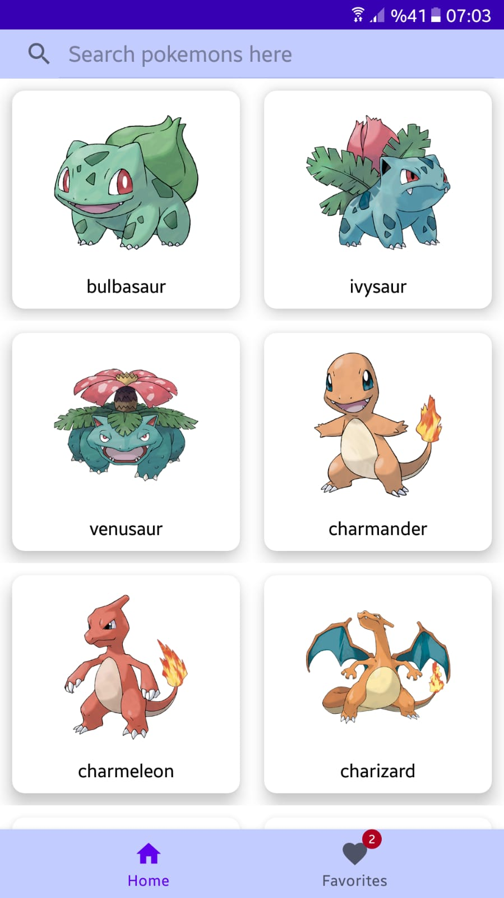
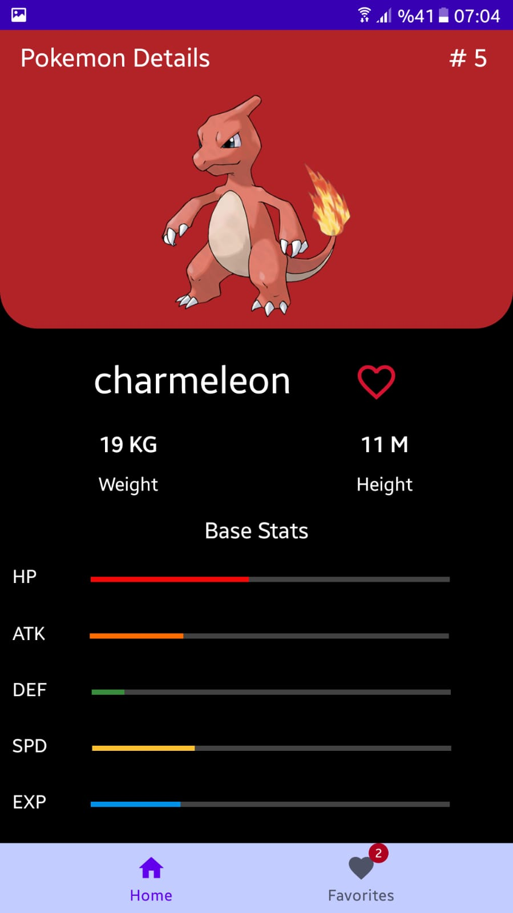
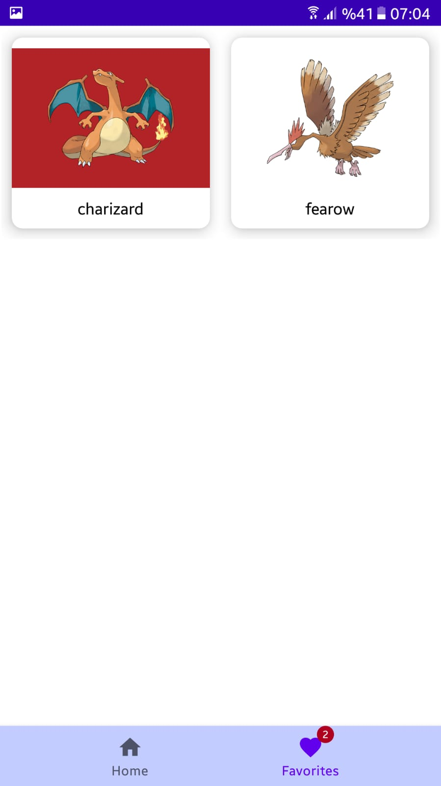
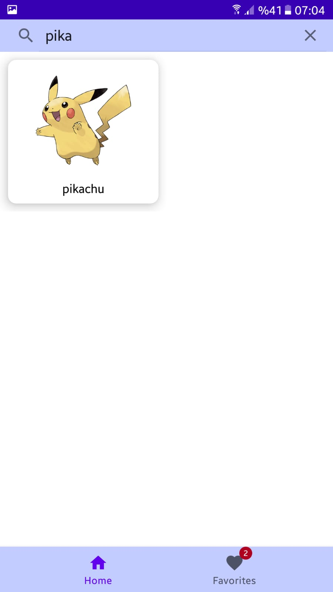
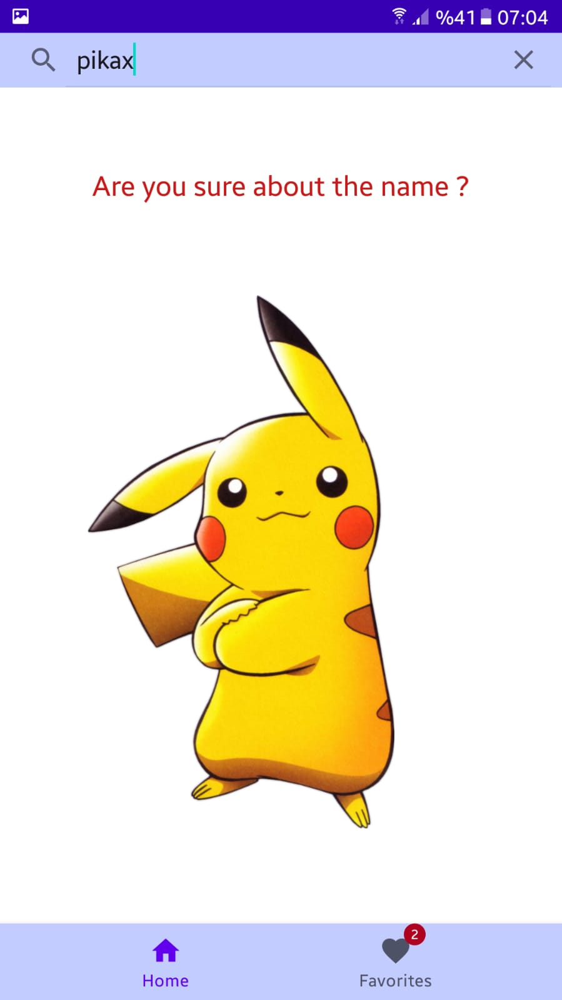

# Pokedex
Pokedex is a pokemon listing app that you can inspect the attributes and the images of the pokemons.
This is the native android application that I created for my 2022 summer intership at Softtech

## Technologies
- The project follows **MVVM** structure,
- **Jetpack Navigation** and Bottom Navigation for navigating,
- **Glide** for image processing,
- **Retrofit** and **Kotlin Coroutines** for Network calls,
- **Room** Database for local storage,
- **Lottie** for animations 

  
## Creator
  Atila İlhan Yatağan  
  Computer Science Student At Marmara University

## References
- Values from PokeApi (https://pokeapi.co/)
- Original idea (https://github.com/skydoves/Pokedex)

## Screenshots
<table>
  <tr>
     <td>Pokemon Listing Page</td>
     <td>Pokemon Detail Page</td>
     <td>Favorite Pokemons Page</td>
  </tr>
  <tr>
    <td></td>
    <td></td>
    <td></td>
  </tr>
 </table>
 
 <table>
  <tr>
     <td>Search Bar</td>
     <td>Failed Search</td>
     <td>Splash Screen</td>
  </tr>
  <tr>
    <td></td>
    <td></td>
    <td></td>
  </tr>
 </table>
 
